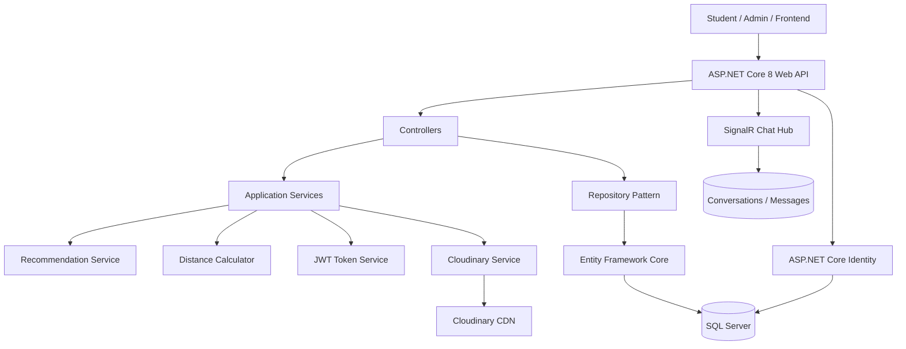

# System Architecture

## Layers

### Controllers
Expose REST endpoints and handle HTTP requests/responses.

### DTOs
Define API input/output contracts without exposing the persistence model directly.

### Services
Contain business logic such as:

- Distance calculation
- Housing recommendations
- JWT token creation
- Cloudinary image operations

### Repository Pattern
Encapsulates database access behind interfaces and keeps controllers independent from EF Core queries.

### Entity Framework Core
Maps domain models to SQL Server and handles migrations and persistence.

### External Services

- **Cloudinary:** housing image storage
- **SignalR:** real-time messaging
- **JWT:** stateless API authentication
