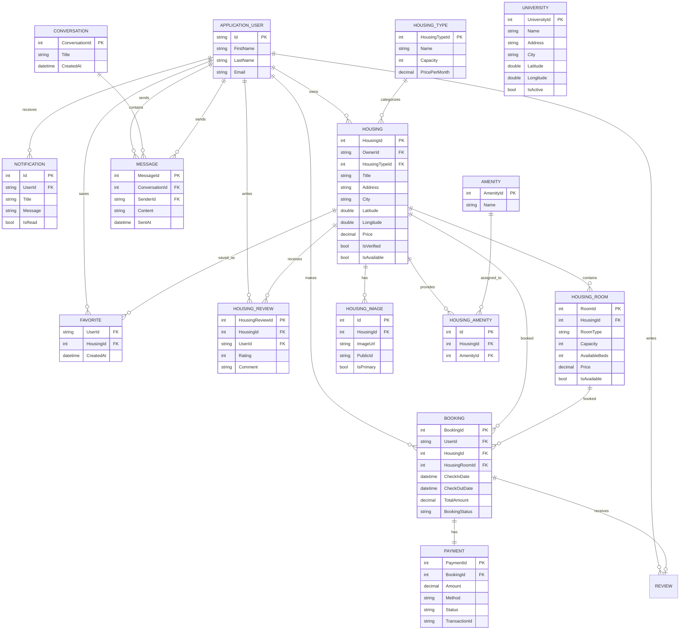

# Database Design

The project uses SQL Server with Entity Framework Core.

## ER Diagram

## Important Design Notes

- `Housing` stores both latitude/longitude and a spatial `Point`.
- `HousingAmenity` implements the many-to-many relationship between housing and amenities.
- `HousingImage` stores the Cloudinary URL and public ID.
- `Booking` can reference a housing and optionally a specific room.
- `Payment` is linked one-to-one with a booking.
- `HousingReview` stores housing-level ratings and comments.
- `ApplicationUser` is based on ASP.NET Core Identity.
